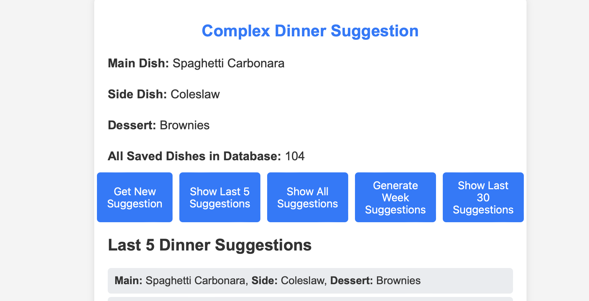
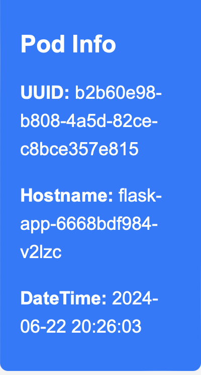

## Python Dinner Application connected to MongoDB 

This is a simple **Python** Application that is connected to **MongoDB** within a **Kubernetes** cluster. 

**Application** is packaged in **Dockerfile** and sent to **Dockerhub**. Then it's packaged using Helm and deployed directly in cluster with **ArgoCD**.

### Functional features

This application serves as a showcase for working with **MongoDB**. It's functionality is very simple.

You can click on 5 different buttons that working with Database.

* Get New Suggestion - adds 1 object to the Database
* Show All Suggestions - shows **ALL** suggestions
* Show Last 5 Suggestions - shows 5 last suggesitons from the Database
* Generate Week Suggestions - adds 7 object to the Database
* Show Last 30 Suggestions - shows 30 last suggesitons from the Database

You can observe the count of items in the database dynamically updating in the **All Saved Dishes in Database** line, which reflects changes in real-time without requiring a page reload.

### Kubernetes integration

This application supports scalability within Kubernetes. You can view which pod the application is currently running on directly in your browser on the left-hand side.

You can reload the page to see how the pods change.

